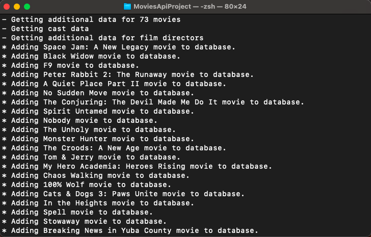

# NodeJS + The Movie DB API + Postgres Example

This example NodeJS script uses API calls to The Movie DB's API to get the list of currently playing movies in a specific region (Germany "DE" by default) and adds/updates this data to a Postgres database.

Things that the example contains:
- Making HTTP requests in NodeJS
- Using promises to handle asynchronous requests/tasks
- Connecting to a local Postgres database
- Sending queries to the database using NodeJS

## How to run
1. Install NodeJS - if you haven't already
2. Run a Posgres Server and set-up the correct credentials in the source code - where the comments guide you.
3. Create a new API key from [TheMovieDB](https://www.themoviedb.org/documentation/api) and put it in the code - where the comments guide you.
4. Change the region in the source code, depending on the country that you want to use for the currently playing movies data.
5. Run `node index.js` in the app's root folder.
6. ???
7. Profit!